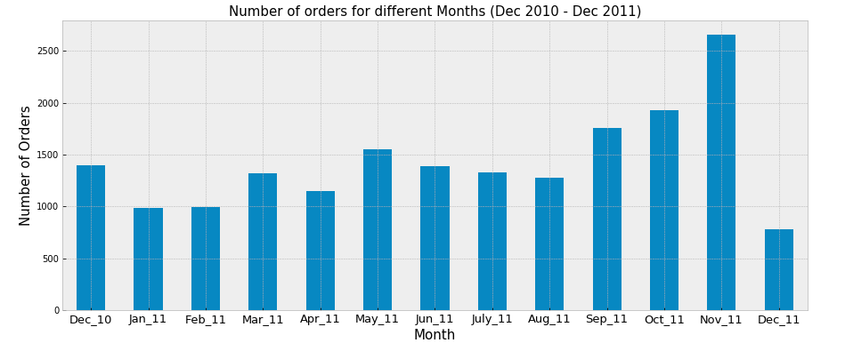
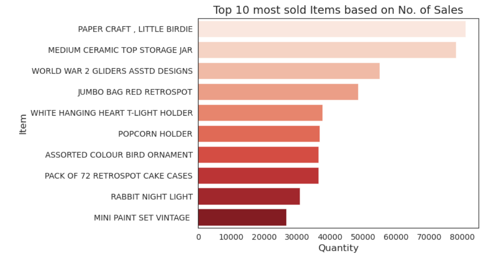
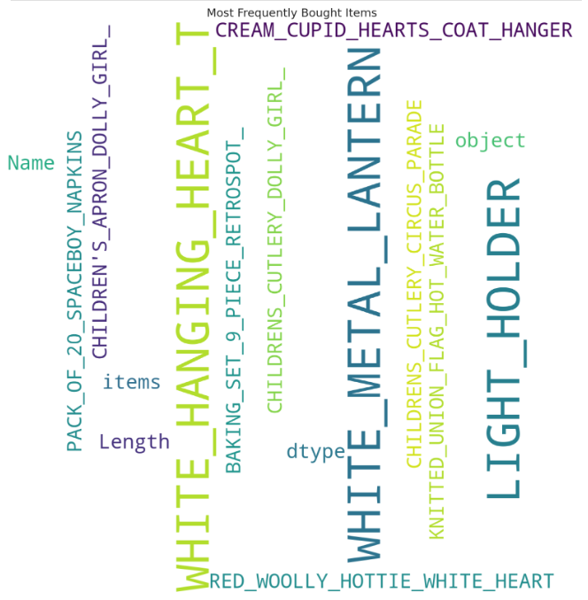

# Building Recommendation system using Rule Based method and Market Basket Analysis
## Business Overview 
With the rapid expansion of e-business platforms across various industries, both the volume of user data and the duration of user engagement have grown significantly. This heightened interaction has driven the adoption of personalized customer experiences, which play a vital role in enhancing customer retention and ultimately contribute to sustained long-term revenue growth for companies.Recommender systems helps companies deliver this personalized customer experiences,improve customer satisfaction, and drive key performance metrics like sales, engagement, and retention.Recommendation systems use sophisticated algorithms to process large volumes of data and filter it based on various factors such as a user's purchase history, preferences, business rules, and product similarities.

In "Rule Based" recommenders, various rules such as popularity of the products, new product launches, discount and offers are considered when making recommendations to users. 
"Market Basket Analysis" uses algorithms such as 'Apirori' to understand the purchase behavior of users ( frequently bought itemsets in the same transaction) using association rules and recommend frequent itemsets to future users. It suses metrics such as support, confidence and lift to determine which are the frequently bought itemsets.

## Project overview 
This project uses a commedities dataset to build recommendation systems based on the both rules based method and market basket analysis technique. 
## Data 
The dataset contains transactional data collected from online retail company that sells unique all occasion gifts which occured between 01/12/2010 and 09/12/2011. Dataset can be found in the [UCL machine learning repository](https://archive.ics.uci.edu/dataset/352/online+retail). It contains information about 500k+ customers over eight attributes which are InvoiceNo, StockCode, Description, Quantity, InvoiceDate, UnitPrice, CustomerID, Country.
## Exploratory Data Analysis(EDA) 
Several customer based and item based insights were gained from the EDA.
### Extracting Customer Insights from the dataset
1. The most loyal customers were from United Kingdom , top 10 loyal customers have made atleast 1600+ transactions and among them the top most loyal customer had made 7847 transactions.
2. The highest revenue generated by a single customer was approximately €280,000, originating from the Netherlands. The remaining customers in the top 10 category, were each contributing at least €77,000 in revenue and are from the United Kingdom, Australia, and Ireland (EIRE).
3. By observing the customer purchase patterns based on the seasonality,following insights were made as shown in the below imgaes :
   
      ***Image 1*** : 
    There's a gradual increase in purchasing activity  from August through November, suggesting stronger user engagement during late fall months.The highest volume of purchases occurred in November 2011, indicating a possible seasonal or promotional effect and had hit the least volume in the December on the same year.

    
      ***Image 2*** :
    There's a steady increase in purchases from Monday to Thursday, followed by a noticeable decline over the weekend. There were no orders were recorded on Saturdays, indicating minimal customer activity on that day.

   
      ***Image 3*** :
   The revenue generated by products based on seasonality closely correlates with customer purchase patterns. Notably, the highest number of purchases occurred in November, which also coincided with the peak in revenue generation during the same month.
4. Considering the items with no unit prices as free items,
   

   ***Image 3***: The highest number of free items was purchased in December 2010, followed by significant spikes in May and December of 2011. This trend suggests that free item purchases tend to peak during late spring and at the end of the year, possibly due to seasonal promotions or holiday campaigns.

### Extracting Items Insights from the dataset
1. The following image depicts the top 10 items bought by most customers. 
   
   ***Image 5***: It shows there's the highest demand for the product 'regency cake stand 3tier'.

2. Based on the amount of sales made by the customers, the below image shows the top 10 most sold items based on the amount of sales.
   
   ***Image 6***: The top 10 best-selling items each recorded over 26,000 units sold. Among them, the highest-selling item was 'Paper Craft, Little Birdie'
   
3. The below image shows the most ordered items.
   
   ***Image 7***: This image shows the highest number of orders were made for the item 'cream hanging heart t-light holder' with an order count of 54.

    

    ***Image 8***: The word cloud aligns with the insights presented in the previous plot, highlighting the most frequently ordered items.

5. Top 5 items that were the first choice by the customers are : 'PAINTED METAL PEARS ASSORTED','LUNCH BAG SPACEBOY DESIGN ','METAL DECORATION NAUGHTY CHILDREN', 'JUMBO BAG RED RETROSPOT' and 'VINTAGE DOILY DELUXE SEWING KIT ' .

